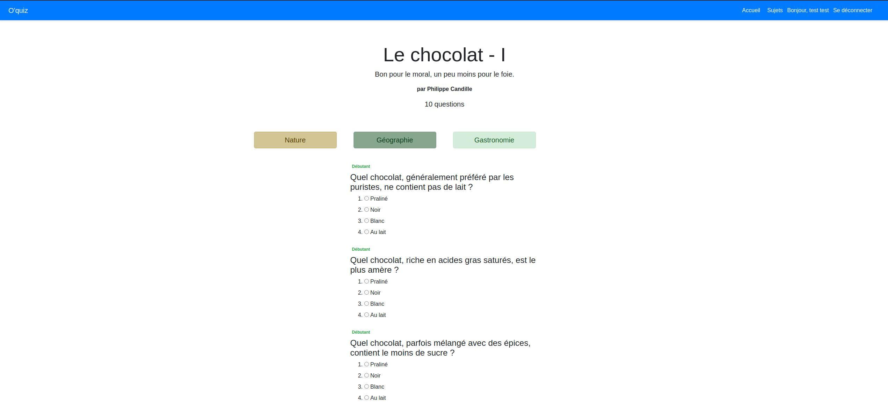

# Quiz

A small quiz app using postgres SQL for the database, sequelize as ORM, node with express for the server and ejs for the HTML template engine.

Instructions to launch the app:
- Clone the repo
- Create a .env file with .env.example content in it
- Run npm i then npm start

Preview: 

